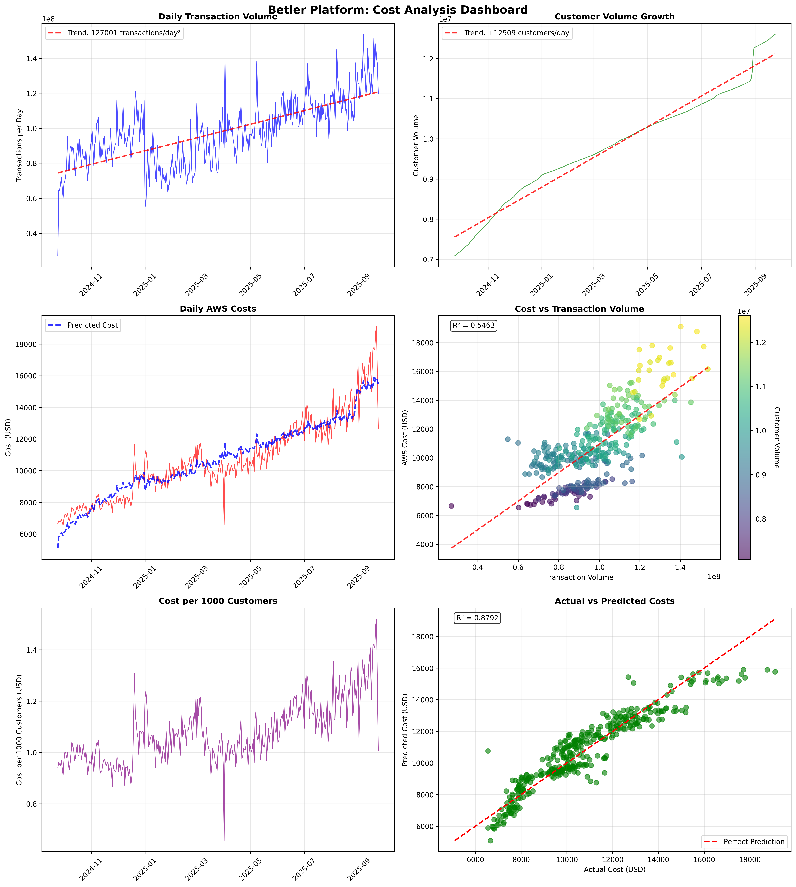
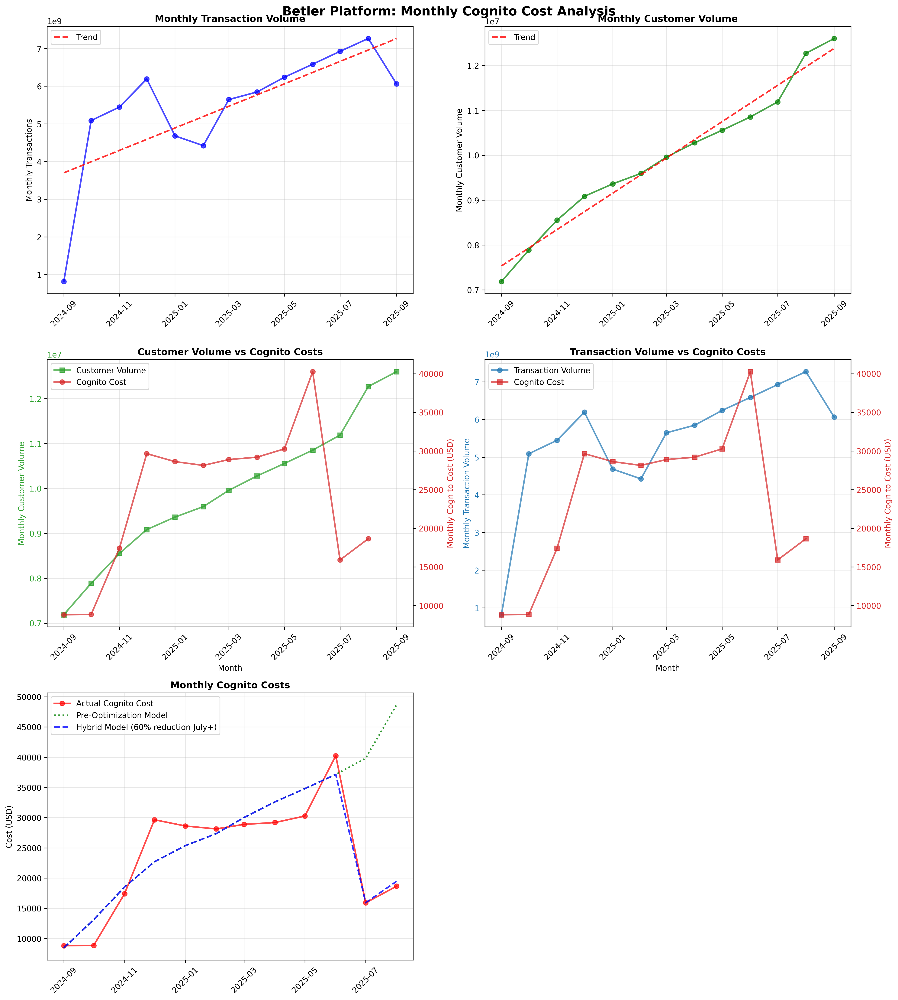
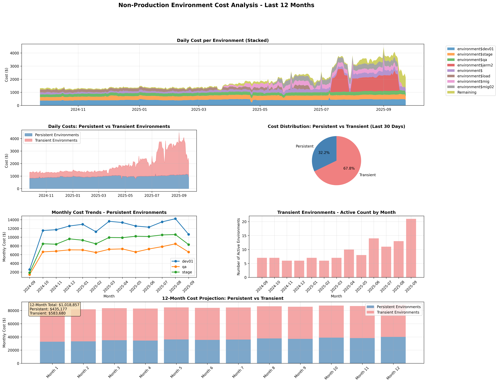
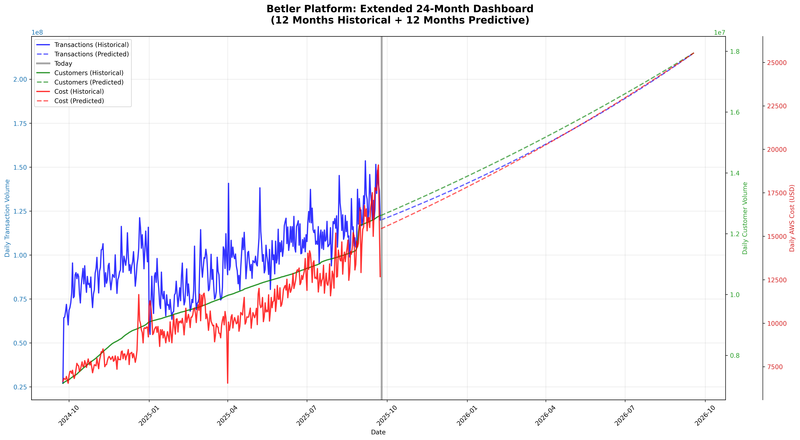

# Betler Cost Analysis Suite

This repository contains a comprehensive cost analysis and prediction system for the Betler platform, providing historical analysis, future projections, and actionable cost insights.

## 12-Month Cost Forecast

**Total Projected Costs: $8,329,039** (production) + **$1,018,857** (non-prod) = **$9,347,896** (next 12 months)

### Production Environment Projections
- **Customer Growth**: 3% monthly (12.27M → 16.98M customers)
- **Transaction Growth**: 5% monthly (7.27B → projected scaling)
- **Model Accuracy**: R² ~0.88 (88% variance explained), RMSE $872 (8.1%)
- **Monthly Progression**: $537,246 → $870,429 (62% growth)

### Non-Production Environment Projections
- **Persistent Environments**: $435,177 (dev01, qa, stage with R² 0.689)
- **Transient Environments**: $583,680 (load testing, dev branches at $1,600/day budget)
- **Total Non-Prod**: $1,018,857 (dual-model prediction system)

## Analysis Dashboards

### Core AWS Cost Analysis


### Cognito Cost Analysis


### Non-Production Cost Analysis


### 24-Month Timeline


## Methodology

### Core AWS Cost Regression
We run **multiple linear regression** on historical costs for the last 12 months using:
- **Customer volume** - pulled from Grafana metrics
- **Transaction volume** - pulled from Grafana metrics
- **Historical AWS costs** - from AWS Cost Explorer API (excluding tax and Cognito)

The regression model provides the data accuracy (R² score) and generates predictions based on volume correlations.

### Cognito Cost Analysis
We perform a **similar linear regression for Cognito costs**, with key differences:
- **Monthly aggregation** - Cognito has large monthly billing cycles rather than daily
- **Hybrid optimization model** - In July 2025, major optimization occurred (60% cost reduction)
- **Post-optimization adjustment** - Regression predictions are multiplied by optimization factor (0.4x)

**Note**: We are unsure if the Cognito predictions will remain accurate going forward, but it represents a small proportion of overall costs.

### Non-Production Cost Analysis
We perform **dual-model analysis for non-production environments**:
- **Persistent environments** (dev01, qa, stage) - Linear regression based on historical growth trends (R² ~0.69)
- **Transient environments** (load testing, temporary dev branches) - Budget cap model at $1,600/day ($400/day per environment × 2-4 environments)
- **Environment categorization** - Automatic classification of 38+ environments into persistent vs transient types
- **High variability area** - Predictions should be revisited as this is under active development

## Quick Start

Run the complete analysis pipeline with a single command:

```bash
./run_all_analysis.sh
```

This master script will:
1. Start TSH proxy centrally for secure Grafana access (prod and dev environments)
2. Clean up all previous output directories and virtual environments
3. Run the core Betler cost analysis with regression modeling
4. Run the Cognito-specific cost analysis with hybrid optimization modeling
5. Run the non-production environment cost analysis with dual-model predictions
6. Generate predictive cost projections with configurable growth parameters
7. Create comprehensive dashboards including 24-month timeline visualization
8. Display 12-month forward-looking cost estimates for all environments
9. Clean up TSH proxies when complete

## Analysis Components

### 1. Core AWS Cost Analysis (`betler_cost_analysis/`)
- Daily AWS cost extraction (excluding tax and Cognito services)
- Multiple linear regression: `Cost = α + β₁×Transactions + β₂×Customers`
- Model validation with R² accuracy reporting
- **Outputs**: Dashboard, regression model, historical data CSV, results JSON

### 2. Cognito Cost Analysis (`cognito_cost_analysis/`)
- Amazon Cognito authentication cost analysis with monthly aggregation
- Hybrid modeling: pre-July 2025 regression × post-optimization factor (0.4)
- Separate validation for optimization effectiveness detection
- **Outputs**: Monthly dashboard, hybrid regression model, cost projections, results JSON

### 3. Predictive Cost Analysis (`betler_predictive_analysis/`)
- Forward-looking cost projections using regression models from both analyses
- Configurable growth parameters (customer growth, transaction growth, projection period)
- Combined cost modeling: Core AWS + Cognito with optimization factors
- **Outputs**: Monthly projection CSV, structured results JSON

### 4. Non-Production Cost Analysis (`betler_non-prod_analysis/`)
- AWS cost extraction for non-production environments grouped by environment tag
- Dual prediction models: linear regression for persistent + budget cap for transient environments
- Environment categorization and cost breakdown by type (persistent vs transient)
- **Outputs**: 6-panel dashboard, dual regression models, environment cost projections, results JSON

### 5. Extended 24-Month Dashboard
- Unified visualization showing 12 months historical + 12 months predictive data
- Triple-axis plot combining transaction volume, customer volume, and AWS costs
- Clear delineation between actual and predicted data
- **Output**: Single comprehensive 24-month timeline visualization

## Individual Analysis

You can also run each analysis separately:

```bash
# Core analysis only
cd betler_cost_analysis
SKIP_TSH_PROXY=true ./core_betler_production_cost_analysis.sh

# Cognito analysis only
cd cognito_cost_analysis
SKIP_TSH_PROXY=true ./cognito_betler_production_cost_analysis.sh

# Non-prod analysis only
cd betler_non-prod_analysis
SKIP_TSH_PROXY=true ./core_betler_non_prod_cost_analysis.sh

# Predictive analysis only (requires core and Cognito to be run first)
cd betler_predictive_analysis
./run_predictive_analysis.sh

# Custom predictive analysis with growth parameters
./run_predictive_analysis.sh --customer-growth 0.04 --transaction-growth 0.06 --months 18
```

## Prerequisites

- `tsh` (Teleport client) for secure Grafana access
- `aws` CLI configured for Cost Explorer access
- `jq` for JSON processing
- Python 3 with `pandas`, `matplotlib`, `numpy`

The scripts automatically set up Python virtual environments and install dependencies.

## Environment Variables

- `SKIP_TSH_PROXY=true` - Skip TSH proxy setup entirely (useful for local development or when proxy is already running)

## Model Accuracy

Both regression models include accuracy metrics:
- **R² (coefficient of determination)** - proportion of variance explained by the model
- **RMSE (root mean square error)** - prediction error magnitude
- **Data quality warnings** - alerts for low R² or insufficient data

Typical performance:
- Core AWS model: R² ~0.88 (88% variance explained)
- Cognito model: R² ~0.87 (87% variance explained, pre-optimization data)
- Non-prod persistent model: R² ~0.69 (69% variance explained)

## Output Files

All analysis results are saved to respective `output/` directories:

### Core Analysis (`betler_cost_analysis/output/`)
- `cost_analysis_dashboard.png` - 6-panel historical dashboard
- `cost_analysis.csv` - Daily data with transactions, customers, costs
- `core_regression_model.json` - Regression coefficients for predictions
- `results.json` - Structured key metrics and model performance

### Cognito Analysis (`cognito_cost_analysis/output/`)
- `cognito_cost_analysis_dashboard.png` - Monthly Cognito cost trends
- `cognito_cost_analysis.csv` - Monthly aggregated data
- `cognito_regression_model.json` - Hybrid model with optimization factors
- `results.json` - Structured metrics including optimization detection

### Non-Production Analysis (`betler_non-prod_analysis/output/`)
- `non_prod_environment_dashboard.png` - 6-panel dashboard with projections
- `aws_costs_by_environment.json` - Raw AWS cost data grouped by environment tag
- `aws_daily_costs.json` - Daily aggregated cost data for trend analysis
- `results.json` - Structured metrics including dual-model predictions

### Predictive Analysis (`betler_predictive_analysis/output/`)
- `extended_24month_dashboard.png` - Unified 24-month timeline visualization
- `predictive_cost_analysis.csv` - Monthly forward projections
- `results.json` - Structured 12-month projections and growth parameters

## 12-Month Cost Estimates

The master script automatically displays forward-looking cost estimates:
- **Total 12-month projection** (production + non-production)
- **Monthly cost progression** (Month 1 vs Month 12)
- **Service breakdown** (Core AWS vs Cognito vs Non-Prod costs)
- **Environment categorization** (Persistent vs Transient non-prod environments)
- **Growth impact analysis**

Example output:
```
==================================================
BETLER COST ANALYSIS - FINAL SUMMARY
==================================================
📊 12-MONTH COST PROJECTION:

  💰 Total Cost (Next 12 Months): $8,329,040
  📈 Monthly Growth: +62.0% ($537,246 → $870,429)
  ☁️  Core AWS: $8,009,820 (96.2%)
  🔐 Cognito: $319,219 (3.8%)

🔧 NON-PROD ENVIRONMENTS (12-month projection): $1,018,857
  🏗️  Persistent (dev01, qa, stage): $435,177
  ⚡ Transient (load testing, etc): $583,680
```